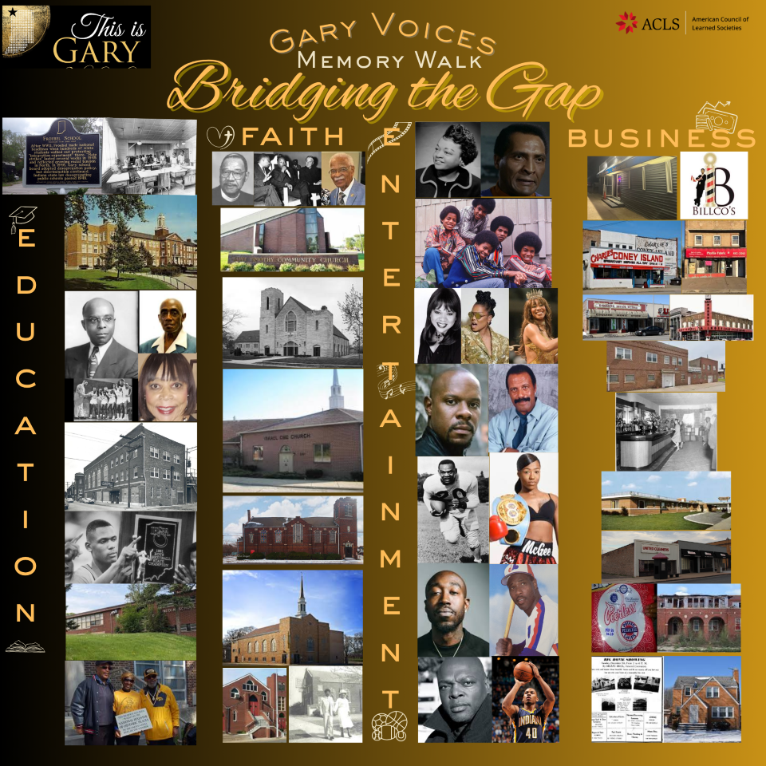
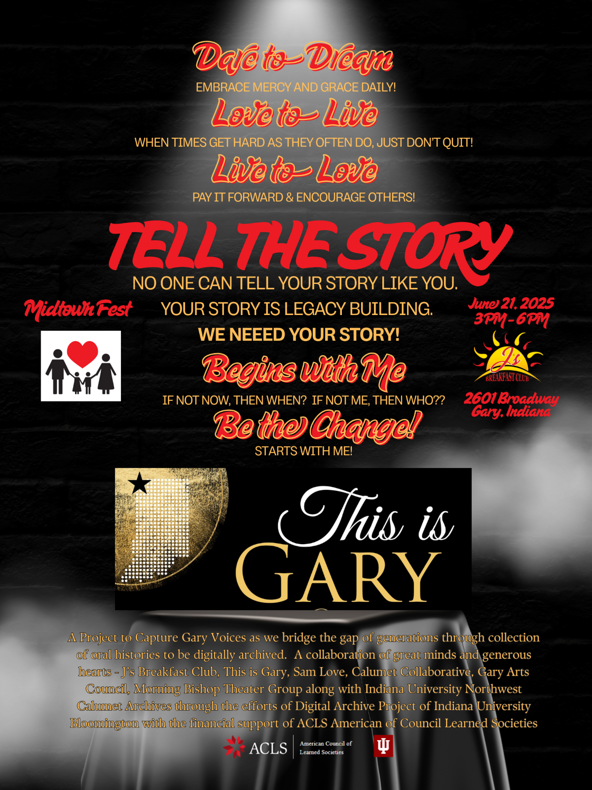
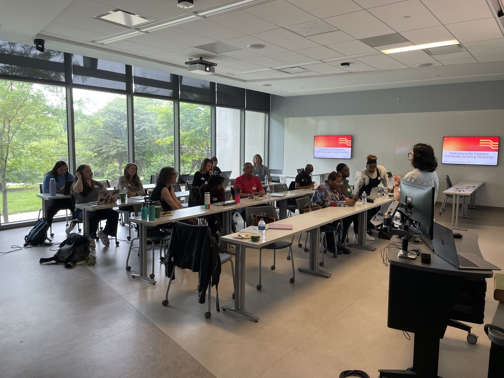
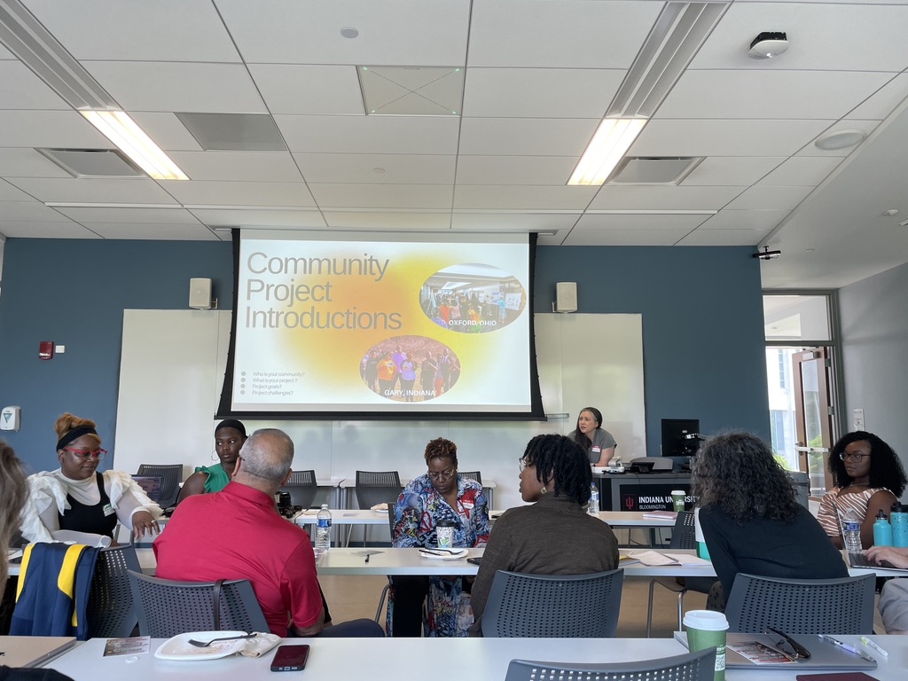
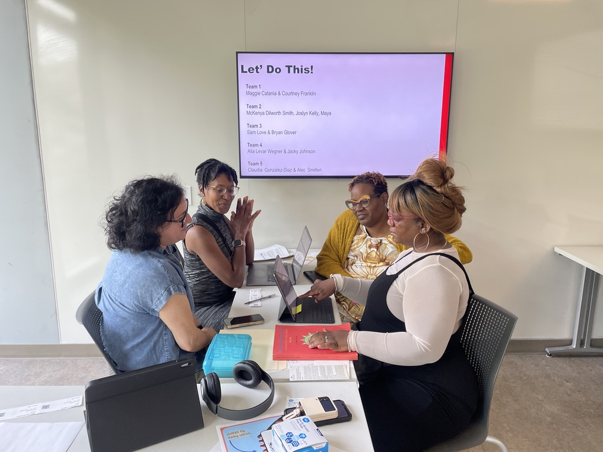
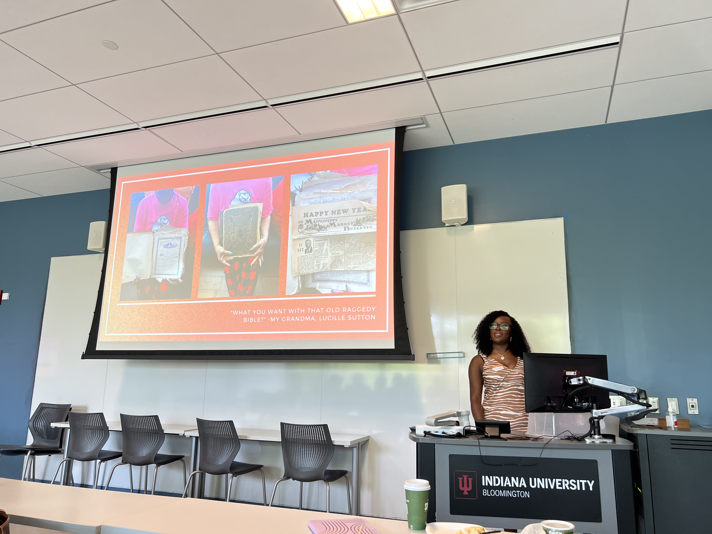
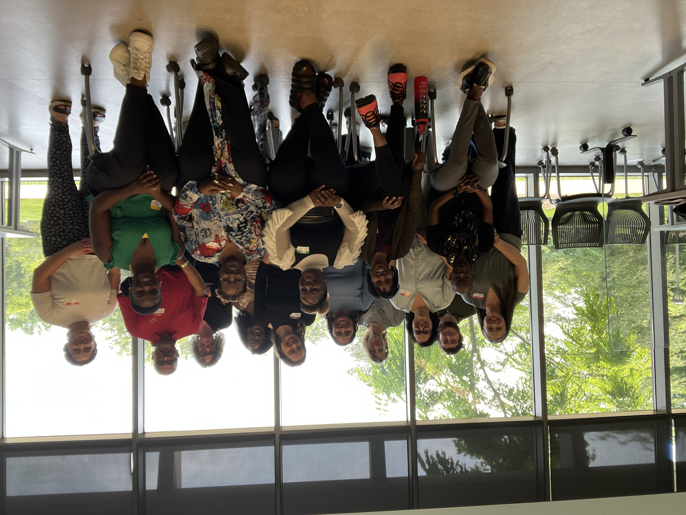
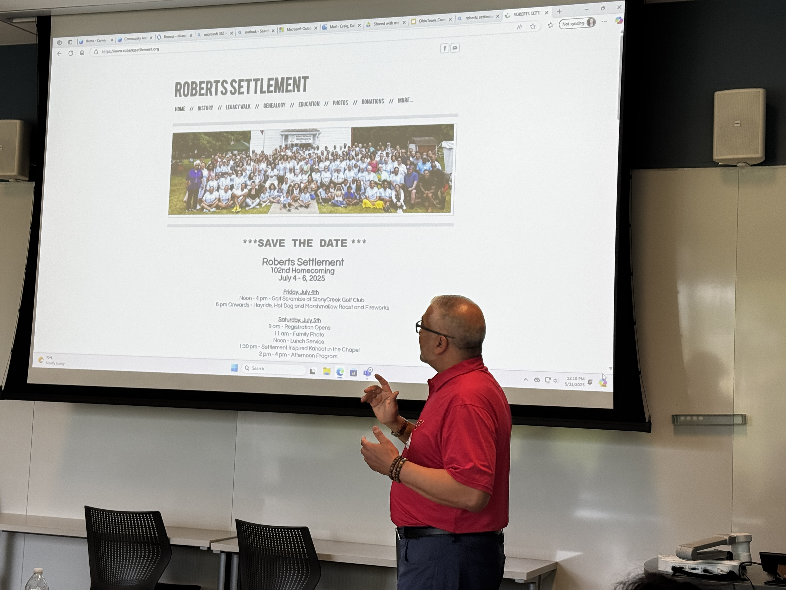
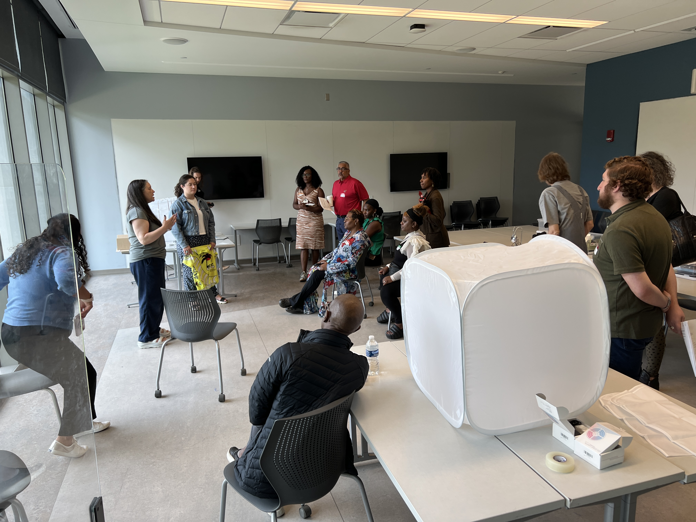

--- 
title: DigitalArc Highlights
layout: blank
permalink: /highlights/
--- 
January 1, {{site.sitedate}}
{% assign SiteYear = timestamp | date: "%Y" %}
{% assign NowYear = "now" | date: "%Y" %}

<html class="no-js" lang="en" dir="ltr">
<head>

</head>
<body id="the-body">

<!--
==================================================
Body
================================================== -->

<button class="menu-icon" type="button" data-toggle="example-menu"></button>

{{ site.title }}

<!--
==================================================
Top Bar
================================================== -->

<ul class="vertical medium-horizontal dropdown menu menu-hover-lines" data-responsive-menu="accordion medium-dropdown">
<!--
==================================================
Home Link for Mobile
================================================== -->
<li class="accentbg home-nav-small">
<a href="{{ site.baseurl }}/">
Home
</a>
</li>
<!--
==================================================
Nav Loop
================================================== -->

<li class="accentbg active">
<a href="{{ nav.url }}" target="_blank"><a href="{{ site.baseurl }}{{ nav.url }}">
{{ nav.title }}<!--{{ page.url }} == {{ nav.url }}-->

</a>
</li>

</ul>

<!--default start-->

<h4 class="center" style="margin-bottom: .25rem;">An exhibit platform for collective storytelling &amp; community archives</h4>

 
# DigitalArc Highlights
{: .subheadline }

## Gary, Indiana Midtown Fest, June 19-22, 2025

> This is Gary along with core community collaborators kick-off the Voices of Gary, a community-led digital archive and storytelling initiative

 

As part of Gary Indiana's Midtown Fest, which celebrates Gary's culture and communities, This is Gary! / Voices of Gary participated in this three-day celebration by hosting a Memory Walk showcasing landmarks, people, and events that makeup this town's glorious past and present. The Memory Walk was developed as a way to engage community members in the telling of a particular story that centers a pivotal aspect of Gary -- what they may recall, what they know, and how they may have particpated. It also allowed community partners to promote an upcoming community story-sharing event in August 2025 in which community members can archive their stories as part of the Voices of Gary digital community archive.

## DigitalArc In-Person Workshop, May 29 - June 1, 2025 in Bloomington, Indiana

> DigitalArc project team and partners walkthrough a “history harvest” during summer in-person workshop

Midwest community leaders worked toward their digital archiving goals at the DigitalArc In-Person Workshop from May 31-June 1, 2025, in Bloomington, Indiana. The focus on this worksop was community and collections. Representing Gary, Indiana Roberts Settlement in Indiana, and Oxford, Ohio, the nine attendees shared approaches to community archiving and learned about the DigitalArc Community Archiving Playbook to weigh which parts of this adapted history harvest format best fit community interests. For the first time, the DigitalArc project team and the project partners met one another in-person during this event!

On Day 1, partners introduced themselves, the community they represented, their community archiving project, and related goals and projected challenges. DigitalArc members spoke about the historical, social justice-driven, and logistical rationale behind DigitalArc philosophy, platform and toolkit. The next day, partners and team members put the Playbook into practice by walking through each station of a hypothetical history harvest event–they checked in “contributors,” tagged objects, collected metadata, and tried out smartphone photography using affordable light boxes.

Learn more about the playbook and the process by visiting the [DigitalArc Toolkit documentation](https://digitalarcplatform.github.io/documentation/), which is a work-in-progress.

 
 
 

 
 
 

